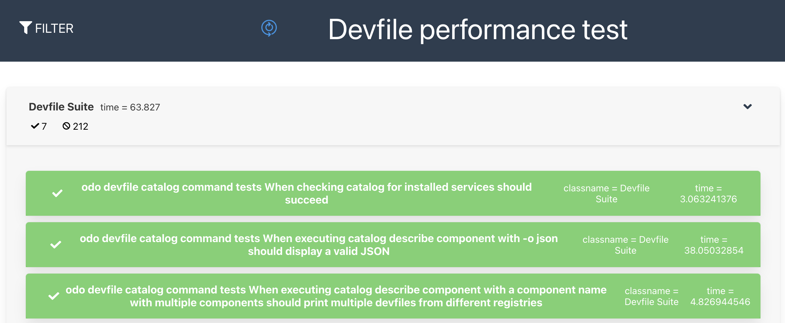

# integration-tests
[](https://github.com/devfile/integration-tests/actions/workflows/pytest.yaml)

This repository contains files related to integration tests for devfile.  

**NOTE:**  
All related issues are being tracked under the main devfile API repo https://github.com/devfile/api with the label `area/integration-tests`

# CI integration tests

- A Github actions workflow is configured to run integration tests (using Pytest) when a PR is opened

- Daily integration tests are configured with [OpenShift CI system](https://docs.ci.openshift.org/docs/how-tos/onboarding-a-new-component/) and runs ODO and ODC tests with devfile.

## Daily ODO CI tests
[ODO integration test cases](./scripts/odo/features/odo-devfile.feature)

| OCP version   |      Prow Test Status    |
|----------|:-------------:|
| 4.10 | [devfile-integration-tests-main-v4.10.odo](https://prow.ci.openshift.org/job-history/gs/origin-ci-test/logs/periodic-ci-devfile-integration-tests-main-v4.10.odo-integration-devfile-odo-periodic) |
| 4.9 | [devfile-integration-tests-main-v4.9.odo](https://prow.ci.openshift.org/job-history/gs/origin-ci-test/logs/periodic-ci-devfile-integration-tests-main-v4.9.odo-integration-devfile-odo-periodic) |
| 4.8 | [devfile-integration-tests-main-v4.8.odo](https://prow.ci.openshift.org/job-history/gs/origin-ci-test/logs/periodic-ci-devfile-integration-tests-main-v4.8.odo-integration-devfile-odo-periodic) |

## Daily ODC CI tests
[ODC integration test cases](./scripts/console/frontend/packages/dev-console/integration-tests/features/addFlow/create-from-devfile.feature)

| OCP version   |      Prow Test Status    |
|----------|:-------------:|
| 4.10 | [devfile-integration-tests-main-v4.10.console](https://prow.ci.openshift.org/job-history/gs/origin-ci-test/logs/periodic-ci-devfile-integration-tests-main-v4.10.console-e2e-gcp-console-periodic) |
| 4.9 | [devfile-integration-tests-main-v4.9.console](https://prow.ci.openshift.org/job-history/gs/origin-ci-test/logs/periodic-ci-devfile-integration-tests-main-v4.9.console-e2e-gcp-console-periodic) |
| 4.8 | [devfile-integration-tests-main-v4.8.console](https://prow.ci.openshift.org/job-history/gs/origin-ci-test/logs/periodic-ci-devfile-integration-tests-main-v4.8.console-e2e-gcp-console-periodic) |

# Local integration tests
**NOTE**: This section covers the required test environment for macOS specifically, however the similar steps can be used for other OSes.

## Pytest for ODO
### Prerequisites
- Python 3.9.9
- pipenv : run `pip install --user pipenv`
- Minikube or OpenShift
- odo

### Run Pytest
1. clone the repository 
2. cd integration-tests
3. run `pipenv install --dev`
4. Start Minikube or OpenShift (e.g. crc)
5. run `pipenv run pytest tests -v` to test all, or `pipenv run pytest tests/<target test>.py -v` to test the target test cases.

## Daily ODO Tests
Tests in this repository are based on [ODO integration tests](https://github.com/openshift/odo/blob/main/docs/dev/test-architecture.adoc#integration-and-e2e-tests) and it mainly focuses on custom test cases with devfile service.

### Prerequisites
- Go 1.16 and Ginkgo latest version
- git
- [OpenShift Cluster](https://github.com/openshift/odo/blob/main/docs/dev/test-architecture.adoc#integration-and-e2e-tests).  e.g. crc environment for 4.* local cluster 
- [Optional] [xunit-viewer](https://www.npmjs.com/package/xunit-viewer)
  and [jrm](https://www.npmjs.com/package/junit-report-merger?activeTab=readme) : required to get performance test results in a merged html format in addition to `junit*.xml`.

### Run tests
1. cd `local/odo`
1. run `./odo-integration-tests.sh`  : it runs `odo catalog command` test by default. In order to run other test cases, modify `./odo-integration-tests.sh` by enabling other test options. e.g. `make test-cmd-devfile-create`

### Performance tests for ODO
1. Open `Makefile` and remove `--skipMeasurements` option from `GINKGO_FLAGS_ALL` flag.
1. Add [Ginkgo's Measure block](https://onsi.github.io/ginkgo/#benchmark-tests) for the spec that you want to measure the performance. A sample `Measure` block can be found from `https://github.com/devfile/integration-tests/tree/main/local/odo/tests/integration/devfile/cmd_devfile_catalog_test.go`
1. [Optional] In order to get test results in html format, uncomment `jrm...` and `xunit-viewer...` command calls from `odo-integration-tests.sh`. 
1. run `./odo-integration-tests.sh`
   
    A sample performance test output in console.
   
    

    A sample test output in html format

   

## Daily ODC Tests
Tests in this repository are based on [ODC integration tests](https://github.com/openshift/console#integration-tests). 

### Prerequisites
1. [node.js](https://nodejs.org/) >= 14 & [yarn](https://yarnpkg.com/en/docs/install) >= 1.20
2. [go](https://golang.org/) >= 1.16+
3. [oc](https://mirror.openshift.com/pub/openshift-v4/clients/oc/4.4/) or [kubectl](https://kubernetes.io/docs/tasks/tools/install-kubectl/) and an OpenShift or Kubernetes cluster. In this document, [CRC](https://cloud.redhat.com/openshift/create/local) is used.
4. [jq](https://stedolan.github.io/jq/download/) (for `contrib/environment.sh`)
5. Google Chrome/Chromium or Firefox for integration tests
6. Cypress - integration tests are implemented in [Cypress.io](https://www.cypress.io/).

### Run tests
1. install [CRC](https://cloud.redhat.com/openshift/create/local) 
1. run `crc setup`
1. run `crc start` and record credentials for `kubeadmin`. You may obtain the credentials by running `crc console --credentials`
1. run `crc oc-env` to configure your shell
1. git clone OpenShift [console](https://github.com/openshift/console) repository
1. build `console`. Login as `kubeadmin` and start a local console.
   ``` 
   cd console  
   ./build.sh        # Backend binaries are output to `./bin`
   oc login -u kubeadmin -p <kubeadmin_password>  
   source ./contrib/oc-environment.sh
   ./bin/bridge
   ```
   The console will be running at http://localhost:9000

1. Update `console/frontend/packages/dev-console/integration-tests/features/addFlow/create-from-devfile.feature` by adding TAG (@smoke) for scenarios to run tests.
1. Launch Cypress test runner
   ```
   cd console/frontend
   yarn run test-cypress-dev-console
   ```
1. click `create-from-devfile.feature` to run test
   
   
For more detail, see https://github.com/openshift/console#integration-tests. 
